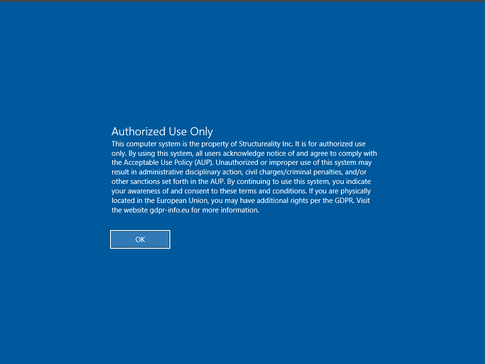

# Windows Login Banner via PowerShell and Registry

## Overview
This project demonstrates how I implemented a directive control by configuring a Windows login warning banner through PowerShell and registry changes.

## Objective
The goal was to display an authorized-use warning to users before login to reinforce policy awareness and direct compliant behavior.

## Actions Performed
- Opened PowerShell as administrator
- Created banner caption and text values
- Wrote:
  - `LegalNoticeCaption`
  - `LegalNoticeText`
- Verified the registry values
- Signed out and restarted the system
- Confirmed the warning banner appeared before login

## Validation
- Verified registry settings were applied successfully
- Confirmed banner display at sign-in

## Security Outcome
This project demonstrates a **directive technical control** because it gives users instructions and policy awareness before access is granted.

## Skills Demonstrated
- PowerShell
- Windows Registry
- administrative configuration
- policy enforcement
- validation and troubleshooting

## Control Type
- **Category:** Technical
- **Function:** Directive

## Screenshots

### Login Warning Banner

### PowerShell Verification

### Login Screen Test

